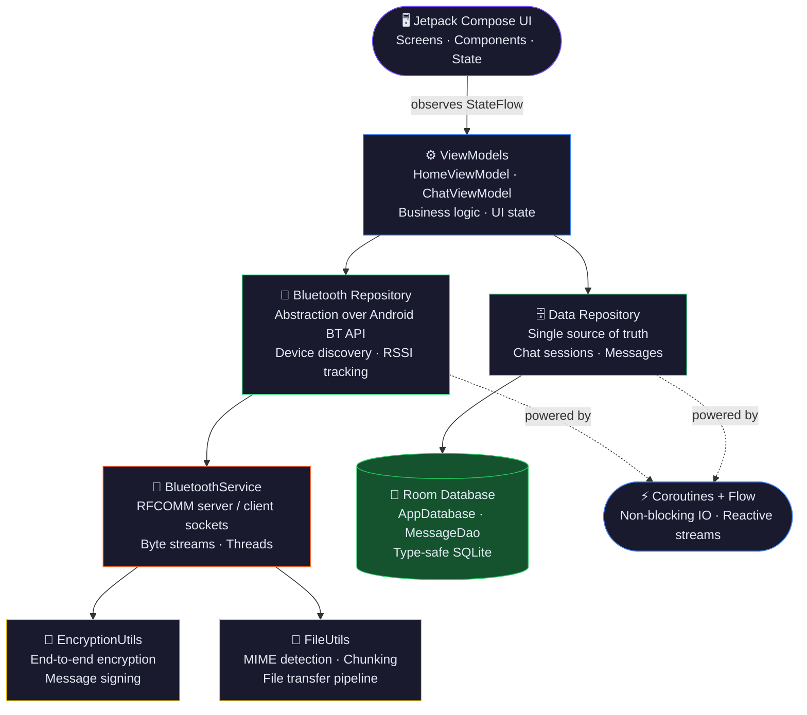

<div align="center">

<br/>

```
██████╗ ██╗████████╗ ██████╗██╗  ██╗ █████╗ ████████╗
██╔══██╗██║╚══██╔══╝██╔════╝██║  ██║██╔══██╗╚══██╔══╝
██████╔╝██║   ██║   ██║     ███████║███████║   ██║   
██╔══██╗██║   ██║   ██║     ██╔══██║██╔══██║   ██║   
██████╔╝██║   ██║   ╚██████╗██║  ██║██║  ██║   ██║   
╚═════╝ ╚═╝   ╚═╝    ╚═════╝╚═╝  ╚═╝╚═╝  ╚═╝   ╚═╝   
```

### Peer-to-peer Bluetooth messaging. No internet. No servers. No compromise.

<br/>

[](https://developer.android.com)
[](https://kotlinlang.org)
[](https://developer.android.com/jetpack/compose)
[](https://developer.android.com/about/versions/oreo)
[](LICENSE)

<br/>

</div>

---

## 📖 What is BitChat?

**BitChat** is an offline-first Android messaging app that uses **Bluetooth Classic** to connect people — no routers, no cell towers, no infrastructure of any kind. Open the app, find a device nearby, and start chatting.

Whether you're in a remote mountain camp, a college campus with a congested network, or simply want truly private, decentralized communication, BitChat has you covered.

> *"The best encrypted chat is the one that never touches a server."*

---

## ✨ Features at a Glance

### 💬 Messaging
| Feature | Details |
|---|---|
| Real-time messaging | Instant send & receive over Bluetooth Classic |
| Persistent sessions | Conversation history stored locally via Room DB |
| Timestamps | Every message stamped with send time |
| Message status | Track sent / delivered indicators |

### 📂 File Sharing
| Feature | Details |
|---|---|
| Multi-format support | Images, documents, and arbitrary files |
| Byte-stream transfer | Fast, efficient raw data pipeline |
| Progress tracking | Live transfer percentage UI |

### 🔐 Security
| Feature | Details |
|---|---|
| Message encryption | End-to-end encryption on the local channel |
| No cloud, ever | Zero data leaves the device pair |
| Device-only auth | Pairing handled by Android's native BT stack |

### 📡 Bluetooth
| Feature | Details |
|---|---|
| Device discovery | Scans and lists nearby Bluetooth devices |
| Seamless pairing | One-tap pair & connect flow |
| Signal strength | RSSI-based signal indicator |

---

## 🏗️ Architecture & Tech Stack

BitChat follows **MVVM + Repository** pattern, ensuring a clean separation of concerns and full testability.



| Layer | Technology | Purpose |
|---|---|---|
| Language | **Kotlin 2.x** | Null-safe, concise, modern Android |
| UI | **Jetpack Compose 1.7+** | Declarative, reactive UI |
| Architecture | **MVVM** | Clean separation, testable logic |
| Local DB | **Room 2.7+** | Structured, type-safe SQLite |
| Connectivity | **Android Bluetooth API** | RFCOMM + BLE socket communication |
| Async | **Coroutines + Flow** | Non-blocking IO, reactive streams |

---

## 📂 Project Structure

```
com.bitchat.app/
│
├── 📁 data/
│   ├── local/
│   │   ├── AppDatabase.kt          # Room database definition
│   │   ├── MessageDao.kt           # DAO for chat messages
│   │   └── entities/               # Room entity data classes
│   └── repository/
│       ├── ChatRepository.kt       # Single source of truth for messages
│       └── DeviceRepository.kt     # Manages discovered BT devices
│
├── 📁 bluetooth/
│   ├── BluetoothService.kt         # RFCOMM server/client socket management
│   ├── BluetoothRepository.kt      # Abstraction layer over BT API
│   └── models/
│       ├── BtDevice.kt             # Device domain model
│       └── TransferState.kt        # File transfer state sealed class
│
├── 📁 ui/
│   ├── screens/
│   │   ├── HomeScreen.kt           # Device discovery & connection list
│   │   ├── ChatScreen.kt           # Message thread UI
│   │   └── SettingsScreen.kt       # App preferences
│   ├── components/
│   │   ├── MessageBubble.kt        # Chat bubble composable
│   │   ├── DeviceCard.kt           # Discovered device list item
│   │   └── TransferProgressBar.kt  # File transfer progress UI
│   └── theme/
│       ├── Color.kt
│       ├── Type.kt
│       └── Theme.kt
│
├── 📁 viewmodel/
│   ├── HomeViewModel.kt
│   └── ChatViewModel.kt
│
└── 📁 utils/
    ├── EncryptionUtils.kt           # Message encryption helpers
    └── FileUtils.kt                 # MIME detection, chunking
```

---

## 🚀 Getting Started

### Prerequisites

- **Android Studio** Meerkat (2025.1.1) or newer
- A physical Android device (Bluetooth simulation is limited on emulators)
- **Minimum SDK:** API 26 (Android 8.0 Oreo)
- **Target SDK:** API 36 (Android 16)

### Installation

**1. Clone the repository**
```bash
git clone https://github.com/your-username/BitChat.git
cd BitChat
```

**2. Open in Android Studio**
```
File → Open → Select the BitChat folder
```

**3. Sync Gradle**

Android Studio will prompt you — click **Sync Now**.

**4. Build & Run**
```bash
# Via terminal
./gradlew assembleDebug

# Or press the green ▶ Run button in Android Studio
```

**5. Install on device**
```bash
adb install app/build/outputs/apk/debug/app-debug.apk
```

> **Tip:** For the best experience, test on **two physical devices** simultaneously. Bluetooth behavior varies significantly between emulators.

---

## ⚠️ Permissions

BitChat requests the following permissions at runtime:

| Permission | Why It's Needed |
|---|---|
| `BLUETOOTH` | Core Bluetooth Classic communication |
| `BLUETOOTH_ADMIN` | Initiating device discovery |
| `BLUETOOTH_CONNECT` *(API 31+)* | Required for Android 12+ BT connections |
| `BLUETOOTH_SCAN` *(API 31+)* | Required for Android 12+ device discovery |
| `ACCESS_FINE_LOCATION` | Android requires this for BT device discovery |
| `READ_EXTERNAL_STORAGE` | Reading files to share |
| `WRITE_EXTERNAL_STORAGE` | Saving received files |

> **Privacy note:** Location permission is a system requirement for Bluetooth discovery — BitChat does **not** collect, store, or transmit your location data.

---

## 🧪 Testing

```bash
# Unit tests
./gradlew test

# Instrumented tests (requires connected device)
./gradlew connectedAndroidTest
```

Test coverage targets:
- `ChatRepository` — message CRUD operations
- `BluetoothRepository` — connection state management
- `ChatViewModel` — UI state transitions
- `EncryptionUtils` — encrypt/decrypt round-trip

---

## 🗺️ Roadmap

| Status | Feature |
|---|---|
| ✅ Done | Bluetooth Classic 1-to-1 messaging |
| ✅ Done | File & image transfer |
| ✅ Done | Message encryption |
| ✅ Done | Persistent chat history |
| ✅ Done | Bluetooth Low Energy (BLE) support |
| ✅ Done | Push-style local notifications |
| 🔄 In Progress | Multi-device group chat mesh |
| 🔄 In Progress | Wi-Fi Direct as fallback transport |
| 📋 Planned | Message read receipts |
| 📋 Planned | Voice note support |
| 📋 Planned | Nearby Share / Android Beam interop |
| 📋 Planned | Predictive connection (reconnect to known devices) |

---

## 🤝 Contributing

Contributions are welcome and appreciated! Here's how to get involved:

**1. Fork the repository**

**2. Create a feature branch**
```bash
git checkout -b feature/ble-support
```

**3. Make your changes**

Please follow the existing code style. Run lint before committing:
```bash
./gradlew lint
```

**4. Commit with a clear message**
```bash
git commit -m "feat: add BLE scanning support for Android 12+"
```

**5. Open a Pull Request**

Describe *what* you changed and *why*. Link any related issues.

### Contribution Guidelines

- Follow [Kotlin coding conventions](https://kotlinlang.org/docs/coding-conventions.html)
- Write tests for new logic in `viewmodel/` and `repository/` layers
- Keep composables stateless where possible — push state to ViewModels
- Document public APIs with KDoc

---

## 📜 License

```
MIT License

Copyright (c) 2026 Sanjeevu Tarun Sree Prasad

Permission is hereby granted, free of charge, to any person obtaining a copy
of this software and associated documentation files (the "Software"), to deal
in the Software without restriction, including without limitation the rights
to use, copy, modify, merge, publish, distribute, sublicense, and/or sell
copies of the Software, and to permit persons to whom the Software is
furnished to do so, subject to the following conditions:

The above copyright notice and this permission notice shall be included in all
copies or substantial portions of the Software.
```


<div align="center">

**If BitChat helped you or you find it interesting:**

⭐ Star it &nbsp;&nbsp;|&nbsp;&nbsp; 🍴 Fork it &nbsp;&nbsp;|&nbsp;&nbsp; 🐛 Report bugs &nbsp;&nbsp;|&nbsp;&nbsp; 💡 Request features

<br/>

*Built with passion to enable communication without limits.*

</div>
